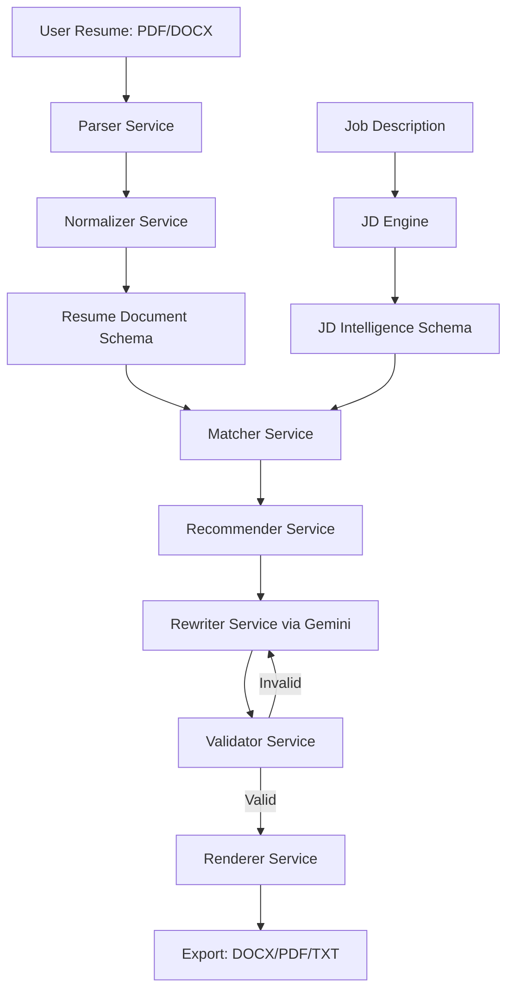

# Resume Intelligence Platform

A state-of-the-art, full-stack resume customization and alignment platform. The system ingests a candidate's resume (PDF or DOCX), analyzes it against a target Job Description (JD), plans tailoring recommendations, structures customized content utilizing Gemini LLM API calls, validates alignment against candidate background history, and renders the result.

The rendering pipeline preserves 100% of the candidate's original document layout, fonts, and styles for DOCX files using in-place text run replacements and prefix preservation.

---

## 🏗️ Architecture Overview

The system is split into a **FastAPI backend** that hosts the analysis, parsing, modification, validation, and rendering services, and a **Next.js 14 frontend** that provides an interactive user interface.



### Backend Components & Service Layer

The backend services are structured inside `backend/app/services/`:

1.  **[Parser Service (parser.py)](file:///c:/Users/rajat/Desktop/resume-intel/resume-intelligence-platform/backend/app/services/parser.py)**
    *   Extracts raw text from PDF files utilizing `pdfplumber` and `fitz` (PyMuPDF) and from DOCX files utilizing `python-docx`.
    *   Cleans and matches section headings (Summary, Experience, Skills, Projects, Education, Certifications). Handles decorative elements like trailing lines, underscores (`_`), dashes (`-`, `–`, `—`), vertical bars (`|`), spaces, and colons in headings.
    *   Extracts contact information and candidate names using heuristics.

2.  **[Normalizer Service (normalizer.py)](file:///c:/Users/rajat/Desktop/resume-intel/resume-intelligence-platform/backend/app/services/normalizer.py)**
    *   Standardizes parsed text, bullet lists, dates, and whitespace into uniform string representations.
    *   Extracts and validates structured dates from raw string ranges.

3.  **[JD Engine (jd_engine.py)](file:///c:/Users/rajat/Desktop/resume-intel/resume-intelligence-platform/backend/app/services/jd_engine.py)**
    *   Ingests target Job Descriptions and structures them using Gemini to extract key parameters: job title, required technical skills, soft skills, responsibilities, and experience level.

4.  **[Matcher Service (matcher.py)](file:///c:/Users/rajat/Desktop/resume-intel/resume-intelligence-platform/backend/app/services/matcher.py)**
    *   Performs structural comparison between candidate parsed schemas and target job requirements to identify key gaps in tech stack and experience levels.

5.  **[Recommender Service (recommender.py)](file:///c:/Users/rajat/Desktop/resume-intel/resume-intelligence-platform/backend/app/services/recommender.py)**
    *   Generates a structured `RecommendationPlan` determining which bullet points to expand, rephrase, or prune, and how the professional summary should be refocused.

6.  **[Rewriter Service (rewriter.py)](file:///c:/Users/rajat/Desktop/resume-intel/resume-intelligence-platform/backend/app/services/rewriter.py)**
    *   Interfaces with LLMs (e.g. Gemini) using structured schemas to rewrite resume sections.
    *   Ensures that only phrasing and impact metrics are optimized without fabricating fake experiences.

7.  **[Validator Service (validator.py)](file:///c:/Users/rajat/Desktop/resume-intel/resume-intelligence-platform/backend/app/services/validator.py)**
    *   Strictly cross-checks the rewritten resume against the original resume to identify potential hallucinations (e.g. company names, employment durations, academic degrees, or certifications not present in the original history).

8.  **[Renderer Service (renderer.py)](file:///c:/Users/rajat/Desktop/resume-intel/resume-intelligence-platform/backend/app/services/renderer.py)**
    *   Reconstructs plain text, PDF (using ReportLab), or customized DOCX documents.
    *   **Layout Preservation (DOCX)**: Modifies text runs in-place. Uses a prefix preservation algorithm that determines the run boundary where the bullet symbol and tab stop/spacing ends, only replacing content runs starting after that boundary. This prevents squashing text against bullet points (e.g. `•Successfully` -> `• Successfully`).
    *   **Safe Fallback Checks**: Employs safety guardrails preventing project or skills bullets from being incorrectly overwritten during fallback sequential bullet matching.

---

## 🛠️ The In-Place Customization Approach

### 1. Structure Extraction & Normalization
Traditional resume tailors simply output plain text, losing all format settings, font stylings, table structures, and borders. Our solution extracts content into strongly typed schemas:
- `ResumeDocument`
- `ExperienceItem`
- `ProjectItem`
- `EducationItem`

### 2. Fine-Grained Run Matching & Prefix Preservation
Paragraphs in a Word document (`.docx`) are represented as sequences of text runs (`p.runs`), each containing individual formatting rules. Direct substitution of paragraph text (e.g. `p.text = new_text`) destroys font weights, sizes, margins, colors, and inline spacing.
Our approach iterates through runs to find the text boundary:
1.  Isolates the bullet symbol and subsequent indentation (spaces, tabs, dashes).
2.  Preserves the runs containing these prefix elements entirely.
3.  Injects the new customized content into the first content run, resetting any trailing runs in the paragraph.
4.  If the original text was squashed (e.g. `•Text`), but the customized text requests space (e.g. `• Text`), the boundaries dynamically add space runs to keep visual alignment clean.

### 3. Strict Verification & Anti-Hallucination
AI customizers frequently invent credentials or experience to match job descriptions. Our platform implements validation rules post-customization:
- Compares list of companies, institutions, and degrees in the original vs rewritten document.
- Scans for any date range modifications.
- Flags and rejects custom outputs containing unrecognized credentials.

---

## 💻 Tech Stack

*   **Backend**: Python, FastAPI, Pydantic v2, `python-docx`, `pdfplumber`, `PyMuPDF` (fitz), `ReportLab`, `pytest`.
*   **Frontend**: React, Next.js 14 (App Router), TypeScript, TailwindCSS.
*   **LLM API**: Google Gemini (via structured schema definitions).

---

## 🚀 Getting Started

### Prerequisites
*   Python 3.11+
*   Node.js 18+

### 1. Run the Backend FastAPI Server
Navigate to the backend directory, activate the virtual environment, install requirements, and run the server:

```powershell
cd backend
python -m venv .venv
.venv\Scripts\activate
pip install -r requirements.txt
uvicorn app.main:app --reload --port 8000
```

*   **API Base URL**: `http://127.0.0.1:8000`
*   **Interactive API Docs (Swagger)**: `http://127.0.0.1:8000/docs`
*   **Health Check**: `curl http://127.0.0.1:8000/api/health`

### 2. Run the Frontend Next.js Server
Navigate to the frontend directory, install dependencies, and start the development server:

```powershell
cd frontend
npm install
npm run dev
```

*   **Local UI URL**: [http://localhost:3000](http://localhost:3000)

---

## 🧪 Testing

We run a complete PyTest test suite verifying schema parsing, normalization, customizer rules, and run rendering:

```powershell
cd backend
.venv\Scripts\pytest
```
